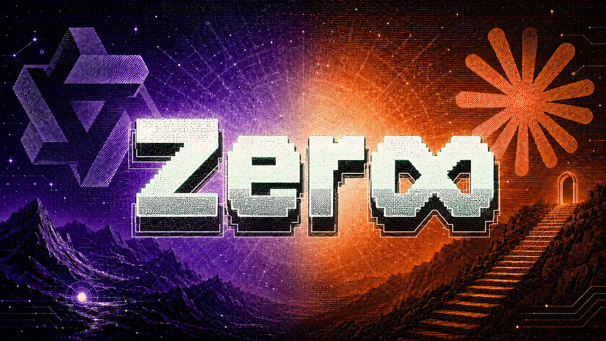

<p align="center">
  
</p>

<h1 align="center">Owning Your Language Model</h1>

<p align="center">
  <strong>Build it. Train it. Align it. Understand it.</strong>
</p>

Owning Your Language Model is a hands-on repository for learning how language models are built, trained, aligned, and evaluated. It brings together from-scratch architecture work, dataset design, supervised fine-tuning, reinforcement learning, and practical experiments.

This repository is not limited to one model. **Zero is the model currently in focus.**

---

## Meet Zero

Zero is the name I gave the current model during training. It starts from **Qwen3 8B** and is being shaped into a focused reasoning and coding model with its own data mixture, training pipeline, and identity.

| | |
| --- | --- |
| **Base model** | Qwen3 8B |
| **Focus** | Reasoning, coding, and physics |
| **Training** | SFT → GSPO |
| **Status** | Active development |

Zero is one product of this repository—not the boundary of it. Future models, training methods, and experiments will live alongside it.

## How Zero Is Trained

### 1. Supervised Fine-Tuning

SFT teaches Zero how strong reasoning and answers should look:

$$
\mathcal{L}_{\mathrm{SFT}} = -\sum_t \log p_\theta(y_t \mid x, y_{<t})
$$

A primary source of reasoning style is a curated set of **Claude Opus 4.7-generated coding and physics traces**, blended with competitive programming, math, general reasoning, and custom Zero identity data.

### 2. Group Sequence Policy Optimization

GSPO follows SFT using separate reward-oriented datasets. It compares groups of generated solutions and strengthens complete sequences that earn better scores:

$$
A_i = \frac{R_i - \mu_R}{\sigma_R + \epsilon}
$$

SFT gives Zero a strong starting behavior. GSPO pushes it toward answers that are not only well written, but more useful and correct.

## What This Repository Covers

- Decoder-only Transformer architecture built in PyTorch
- Tokenization, pretraining, and generation
- Dataset curation and supervised fine-tuning
- LoRA and parameter-efficient training
- GSPO, reward design, and model alignment
- Evaluation, model merging, and training experiments

The from-scratch implementation currently includes a **363M-parameter Transformer** with RMSNorm, RoPE, multi-head attention, SwiGLU, and tied embeddings. Explore it in [`SLM_Architecture`](SLM_Architecture/).

## Start From Scratch

```bash
git clone https://github.com/madhvantyagi/Owning-Language-model.git
cd Owning-Language-model/SLM_Architecture
pip install -r requirements.txt
python model/slm_model.py
```

---

<p align="center">
  <strong>Own the pipeline—not just the output.</strong><br />
  <sub>Built by <a href="https://github.com/madhvantyagi">@madhvantyagi</a></sub>
</p>
